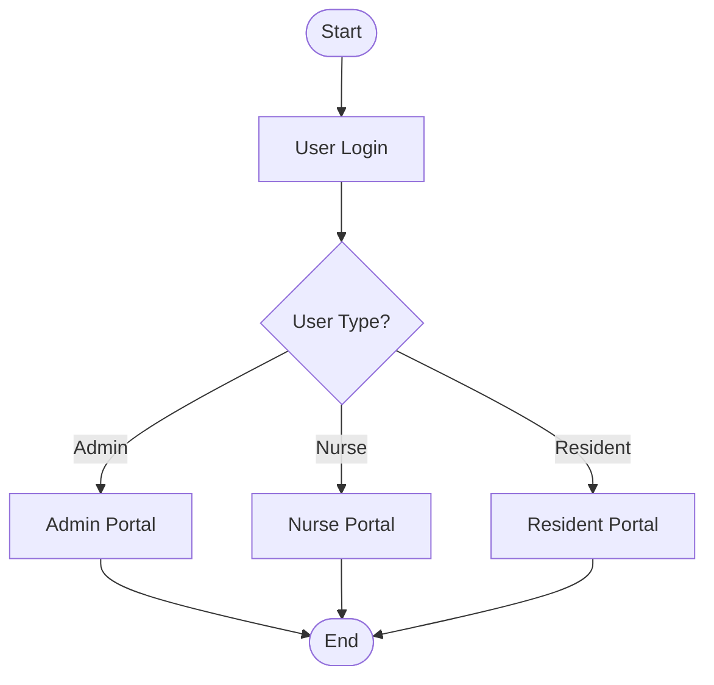
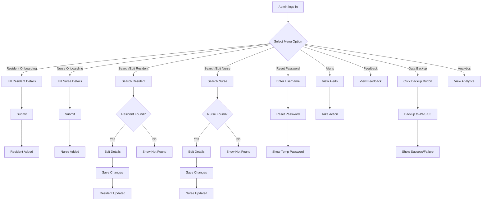
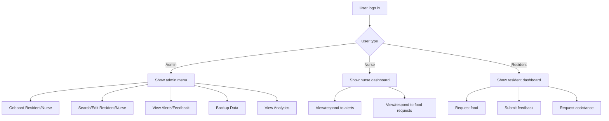

# Aged Care Assistance System

## Overview
The Aged Care Assistance System is designed to improve data management and emergency response in retirement facilities. This system utilizes a Python backend with Flask, a frontend built with HTML, CSS, and JavaScript, and Excel as the database for storing resident information and incident reports.

## Project Structure
```
aged-care-assistance-system
├── backend
│   ├── app.py
│   ├── database
│   │   └── excel_manager.py
│   ├── routes
│   │   ├── admin
│   │   │   └── admin.py
│   │   ├── nurses
│   │   │   └── nurseportal.py
│   │   └── residents
│   │       ├── emergency.py
│   │       ├── food_requests.py
│   │       └── resident_details.py
│   └── requirements.txt
├── frontend
│   ├── html
│   │   ├── admin.html
│   │   ├── login.html
│   │   ├── nurseportaltwo.html
│   │   ├── ondemand_food.html
│   │   └── residents_index.html
│   ├── css
│   │   └── styles.css
│   └── js
│       ├── main.js
│       ├── login_hash.js
│       ├── admin_alerts.js
│       └── alerts_analytics.js
├── data
│   ├── residents.xlsx
│   ├── nurses.xlsx
│   ├── users.xlsx
│   ├── alerts.xlsx
│   ├── food_alerts.xlsx
│   └── feedback.xlsx
└── README.md
```

## Features
- **Emergency Alerts**: Quickly log incidents and send alerts to nursing staff for rapid response.
- **Resident Management**: Onboard, search, view, and edit resident records, health information, and incident reports using an Excel database.
- **Nurse Management**: Onboard, search, view, and edit nurse records and unit allocations.
- **Food Requests**: Residents can request on-demand food; nurses can view and serve food requests.
- **User Management**: Admins can manage user accounts, reset passwords, and activate/deactivate users.
- **Data Backup**: Admins can back up all system data to an AWS S3 bucket with a single click.
- **Analytics & Reporting**: View statistics and analytics on alerts, food requests, and system usage.
- **Resident Feedback**: Collect and review feedback from residents for continuous improvement.
- **User-Friendly Interface**: Responsive frontend for easy interaction by staff, nurses, and admins.

## Setup Instructions
Pre-requisites:
- Python 3.x installed
- Flask installed (`pip install Flask`)

1. **Clone the Repository to a folder in your local machine**:
   ```bash
   git clone https://github.com/drishya-r1/aged-care-system.git
   cd aged-care-system
   ```
2. **Install Backend Dependencies**:
   Navigate to the `backend` directory and install the required packages:
   ```bash
   python3 -m venv .venv
   source .venv/bin/activate  # On Windows use: .venv\Scripts\activate

   ```

3. **Install Backend Dependencies**:
   Install the required packages:
   ```bash
   pip install -r backend/requirements.txt
   ```

4. **Run the Backend**:
   Start the Flask application from the project root:
   ```bash
   python3 -m backend.app
   ```
   This will start the backend and frontend server (usually on `http://127.0.0.1:5000`).
   Then visit [http://127.0.0.1:5000](http://127.0.0.1:5000)  in your browser.

## System Usage

### Admin
- Log in with your admin credentials.
- Use the sidebar to onboard residents and nurses, search/edit records, reset passwords, view alerts, review feedback, and perform data backup to AWS S3.
- Use the Analytics section to view system statistics and reports.

### Nurse
- Log in with your nurse credentials.
- View and attend to emergency alerts and food requests for your assigned units.
- Update alert statuses as you respond to requests.

### Resident
- Log in with your resident credentials.
- Request food on demand and submit feedback.
- View your own information and request assistance as needed.

All actions are performed through a user-friendly web interface accessible via your browser at [http://127.0.0.1:5000](http://127.0.0.1:5000).

## System Flowchart



## Detailed System Flowchart for Admin Actions




## Decision Tree (User Actions)



<!-- ## System Detailed Flowchart


 -->
